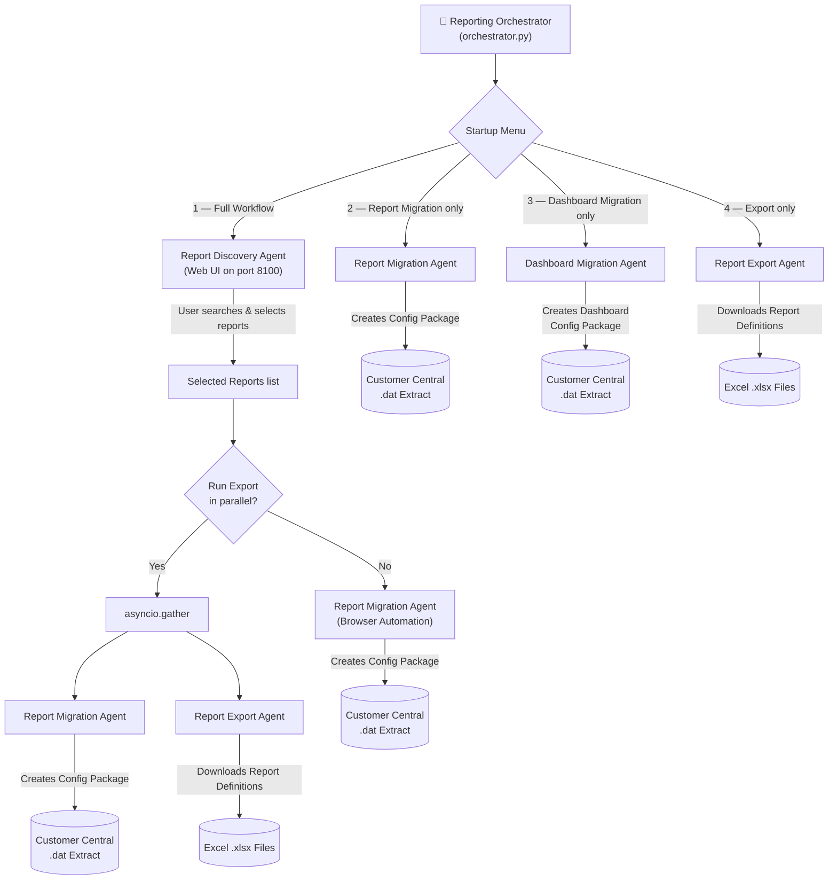

# Workday Reporting Orchestration Agent

An intelligent, multi-agent automation platform for discovering, migrating, and exporting Workday custom reports and dashboards. The system combines AI-powered search with Playwright browser automation to streamline cross-tenant Workday operations.

---

## Architecture Flow



---

## The Four Agents

### 1. Report Discovery Agent (Web UI)

A web-based search interface for finding reports across a catalog of 11,000+ Workday custom reports.

| Feature | Description |
|---|---|
| **Hybrid Search** | Combines BM25 keyword matching with LLM-based semantic re-ranking for high-relevance results |
| **Workday Sync** | Connects to a Workday RaaS endpoint to keep the local report catalog up-to-date |
| **Auto-Sync Overlay** | UI loads immediately; a professional loading overlay displays while background sync fetches the latest reports |
| **LLM Scoring** | Optional GPT-4o integration for intelligent report relevance scoring |
| **Handoff** | Selected reports are seamlessly passed to the Orchestrator for downstream automation |

**Tech stack:** FastAPI + Uvicorn backend, vanilla HTML/CSS/JS frontend, BM25 engine, OpenAI LLM scorer.

**Key files:**

| File | Purpose |
|---|---|
| `Workday_Report_Discovery_Agent/api_server.py` | FastAPI server with REST endpoints (`/api/search`, `/api/stats`, `/api/sync-status`) |
| `Workday_Report_Discovery_Agent/agent.py` | Core `ReportDiscoveryAgent` class — two-stage pipeline (BM25 → LLM) |
| `Workday_Report_Discovery_Agent/bm25_engine.py` | BM25 keyword retrieval engine with field boosting |
| `Workday_Report_Discovery_Agent/llm_scorer.py` | LLM-based relevance scorer using OpenAI API |
| `Workday_Report_Discovery_Agent/sync_catalog.py` | Workday RaaS catalog synchronization |
| `Workday_Report_Discovery_Agent/report_catalog.py` | Report catalog loader and data model |
| `Workday_Report_Discovery_Agent/static/` | Frontend UI (HTML, CSS, JS) |

---

### 2. Report Migration Agent (`run_agent.py`)

Uses Playwright browser automation to migrate selected custom reports between Workday tenants (e.g., DPT3 → Customer Central).

**Automated flow:**
1. **Login** → Workday DPT3 tenant via username/password
2. **Create Configuration Package** → Named `{Industry}_Config_Package_{MM/DD/YYYY}` with Implementation Type = **"Custom Reports"**
3. **Add Instances** → Filters and selects each report from the 10k+ row grid
4. **Migrate** → Initiates migration to Customer Central
5. **Customer Central** → Pauses for SSO login, creates Configuration Extract, downloads `.dat` file

---

### 3. Dashboard Migration Agent (`run_dashboard_agent.py`)

Identical workflow to the Report Migration Agent but creates a Configuration Package with **"Custom Dashboards with Tabs"** as the Implementation Type.

| Aspect | Report Migration | Dashboard Migration |
|---|---|---|
| Implementation Type | `Custom Reports` | `Custom Dashboards with Tabs` |
| Package name format | `{Industry}_Config_Package_{date}` | `{Industry}_Dashboard_Config_Package_{date}` |
| Input method | Discovery UI or manual entry | Manual terminal entry |
| Config builder | `run_agent.py` | `run_dashboard_agent.py` |

> **Code reuse:** `run_dashboard_agent.py` imports shared helpers (`_report_steps`, `_row_checkbox_selector`, `_customer_central_steps`) from `run_agent.py` — no code duplication.

---

### 4. Report Export Agent (`run_export.py`)

Downloads report definitions as Excel files by automating the Workday "Export to Excel" workflow.

**Automated flow:**
1. **Login** → Workday DPT3 tenant
2. **For each report:** Global Search → navigate to Report Definition → click "Export to Excel"
3. **Download** → Saves `.xlsx` files to the `exported_reports/` directory

---

## Orchestrator (`orchestrator.py`)

The orchestrator is the **recommended entry point**. It provides a styled terminal menu and manages the lifecycle of all agents.

### Startup Menu

```
╔══════════════════════════════════════════════════════════╗
║          Workday Report Migration Orchestrator          ║
║          Discovery  →  Migration  →  Export             ║
╚══════════════════════════════════════════════════════════╝

  ── Select Workflow ──

  [1] ★  Full Workflow  (Discovery → Report Migration → Export)
  [2]    Report Migration Agent only
  [3]    Dashboard Migration Agent only
  [4]    Export (Report Definition) Agent only
```

### Workflow Modes

| Mode | What it does |
|---|---|
| **1 — Full Workflow** | Launches Discovery UI → user selects reports → optionally runs Export in parallel with Migration |
| **2 — Report Migration only** | Prompts for industry + report names → creates Config Package with "Custom Reports" |
| **3 — Dashboard Migration only** | Prompts for industry + dashboard names → creates Config Package with "Custom Dashboards with Tabs" |
| **4 — Export only** | Prompts for report names → downloads report definitions as Excel |

### Features

- **Unique package names** with date stamps: `Healthcare_Config_Package_07/17/2026`
- **Parallel execution** via `asyncio.gather` (Migration + Export run simultaneously in isolated browser contexts)
- **Independent error handling** — one agent's failure doesn't cancel the other
- **Styled console output** with ANSI colors, Unicode box-drawing, and progress tracking
- **Native Windows popups** for completion/error summaries

---

## Project Structure

```
Report_Migration_Agent_Final/
├── orchestrator.py              # Main entry point — agent menu & workflow orchestration
├── run_agent.py                 # Report Migration config builder
├── run_dashboard_agent.py       # Dashboard Migration config builder
├── run_export.py                # Report Export config builder
├── runner.py                    # Core Playwright step execution engine (sync + async)
├── console.py                   # Styled ANSI terminal output helpers
├── utils.py                     # Shared utilities (popup, env setup, Playwright install)
├── .env                         # Environment config (API keys, credentials)
├── requirements.txt             # Python dependencies
├── build.bat                    # Build script for creating .exe
│
├── Workday_Report_Discovery_Agent/
│   ├── api_server.py            # FastAPI REST server
│   ├── agent.py                 # ReportDiscoveryAgent (BM25 + LLM pipeline)
│   ├── bm25_engine.py           # BM25 keyword retrieval
│   ├── llm_scorer.py            # LLM relevance scoring via OpenAI
│   ├── report_catalog.py        # Report data model & loader
│   ├── sync_catalog.py          # Workday RaaS catalog sync
│   ├── stemmer.py               # Porter stemmer for search
│   ├── synonyms.py              # Synonym expansion for queries
│   ├── config.py                # Centralized configuration
│   ├── cli.py                   # CLI entry point for standalone use
│   ├── static/                  # Web UI (index.html, styles.css, app.js)
│   ├── data/                    # Report catalog JSON
│   └── prompts/                 # LLM prompt templates
│
├── dist/                        # PyInstaller output (.exe)
├── build/                       # PyInstaller build artifacts
└── exported_reports/            # Downloaded Excel report definitions
```

---

## Setup

### Prerequisites

- **Python 3.10+**
- **Google Chrome** (used as the browser channel for Playwright)
- **Windows 10+** (for native popup support and ANSI terminal)

### Installation

```powershell
# Clone the repository
git clone https://github.com/rishabhsaklani08/Reporting_Orchestrator_Agent.git
cd Reporting_Orchestrator_Agent

# Create and activate virtual environment
python -m venv .venv
.venv\Scripts\activate

# Install dependencies
pip install -r requirements.txt

# Install Playwright browsers (automatic on first run, but can be done manually)
playwright install chromium
```

### Environment Configuration

Create a `.env` file in the project root (auto-created on first run if missing):

```env
# ── LLM Configuration (for AI-powered report discovery) ──
OPENAI_API_KEY=sk-...
OPENAI_BASE_URL=
MODEL_NAME=gpt-4o

# ── Workday Tenant Credentials (for catalog sync from Workday RaaS) ──
WORKDAY_RAAS_URL=
WORKDAY_ISU_USERNAME=
WORKDAY_ISU_PASSWORD=

# ── Workday Login Credentials (for Migration & Export agents) ──
# These are prompted at runtime if left blank.
WD_USER=
WD_PASS=

# ── Search Tuning (optional) ──
BM25_TOP_N=30
LLM_TOP_K=5
```

> **Note:** `OPENAI_API_KEY` is optional — the Discovery Agent falls back to keyword-only (BM25) search if not set.

---

## Usage

### Run via Python (development)

```powershell
.venv\Scripts\python.exe orchestrator.py
```

### Run via Executable (production)

The pre-built `Reporting_Orchestrator.exe` in the `dist/` folder bundles everything:

```powershell
.\dist\Reporting_Orchestrator.exe
```

### Run Individual Agents (standalone)

Each agent can also be run independently:

```powershell
# Report Migration only
.venv\Scripts\python.exe run_agent.py

# Dashboard Migration only
.venv\Scripts\python.exe run_dashboard_agent.py

# Report Export only
.venv\Scripts\python.exe run_export.py
```

---

## Building the Executable

Build a single-file `.exe` using PyInstaller:

```powershell
.venv\Scripts\pyinstaller.exe --noconfirm --onefile --name "Reporting_Orchestrator" `
  --add-data "Workday_Report_Discovery_Agent/static;Workday_Report_Discovery_Agent/static" `
  --add-data "Workday_Report_Discovery_Agent/data;Workday_Report_Discovery_Agent/data" `
  --add-data "Workday_Report_Discovery_Agent/prompts;Workday_Report_Discovery_Agent/prompts" `
  --hidden-import "run_dashboard_agent" `
  --hidden-import "Workday_Report_Discovery_Agent" `
  --hidden-import "Workday_Report_Discovery_Agent.config" `
  --hidden-import "Workday_Report_Discovery_Agent.api_server" `
  --hidden-import "Workday_Report_Discovery_Agent.agent" `
  --hidden-import "uvicorn.logging" `
  --hidden-import "uvicorn.loops" `
  --hidden-import "uvicorn.loops.auto" `
  --hidden-import "uvicorn.protocols.http.auto" `
  --hidden-import "uvicorn.protocols.websockets.auto" `
  --hidden-import "uvicorn.lifespan.on" `
  orchestrator.py
```

The resulting `Reporting_Orchestrator.exe` will be in the `dist/` folder.

---

## Runner Engine (`runner.py`)

The runner is a config-driven Playwright execution engine. All agents generate step configs that the runner executes.

### Config Format

```jsonc
{
  "browser": "chromium",          // chromium | firefox | webkit
  "channel": "chrome",            // chrome | msedge
  "headless": false,
  "viewport": { "width": 1440, "height": 900 },
  "steps": [ /* see below */ ]
}
```

### Available Step Actions

| Action | Required Fields | Optional Fields | Description |
|---|---|---|---|
| `navigate` | `url` | `wait_until`, `timeout` | Navigate to a URL |
| `click` | a *target* | `timeout`, `nth`, `confirm_hidden` | Click an element |
| `type` | a *target* + value | `timeout`, `sequential`, `clear`, `delay` | Type into a field |
| `press` | `key` | `selector`, `timeout` | Press a keyboard key |
| `wait_for` | `selector` | `state`, `timeout` | Wait for an element |
| `wait` | — | `seconds` | Pause for N seconds |
| `scroll` | — | `direction`, `pixels` | Scroll the page |
| `scroll_into_view` | `selector` | `timeout` | Scroll element into view |
| `screenshot` | — | `path`, `full_page` | Save a screenshot |
| `download` | a *target* | `path`, `timeout`, `nth` | Click and save a file download |
| `pause` | — | `title`, `message` | Block until user confirms (modal popup) |
| `dump` | — | `selector`, `contains`, `html`, `limit` | Debug: print element details |

### Targeting (for `click` / `type`)

Provide exactly one of:
- `selector` — raw CSS / Playwright selector
- `byLabel` — match a form field by its label text
- `byRole` — match by ARIA role (e.g., `{"role": "button", "name": "Filter"}`)
- `automation_label` — match `[data-automation-label="..."]`
- `text` — match by visible text (`click` only)

### Credentials

Never put passwords in config files. Use environment variables:

```jsonc
{ "action": "type", "selector": "input[name='username']", "env": "WD_USER" },
{ "action": "type", "selector": "input[name='password']", "secret_env": "WD_PASS" }
```

---

## Key Design Decisions

| Decision | Rationale |
|---|---|
| **Agents run independently** | Each agent has its own browser context; failures are isolated |
| **Date-stamped package names** | Prevents naming collisions across sessions |
| **Background auto-sync** | Server starts instantly; reports sync in a background thread |
| **Port 8100** for Discovery UI | Avoids conflicts with other local services |
| **Code reuse** for Dashboard agent | Imports shared helpers from report agent — only the Implementation Type differs |
| **PyInstaller single-file .exe** | Zero-install distribution for end users |
