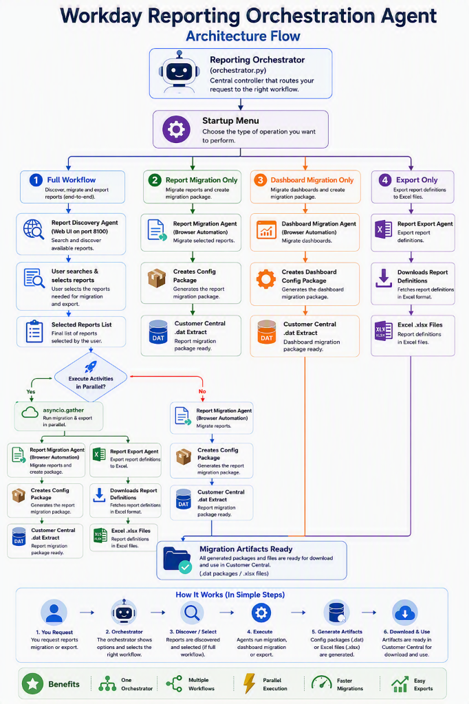

# Workday Reporting Orchestration Agent

An intelligent, multi-agent automation platform for discovering, migrating, and exporting Workday custom reports and dashboards. The system combines AI-powered semantic search with Playwright browser automation to streamline cross-tenant Workday operations through a unified desktop and web interface.

---

## Architecture Flow

<p align="center">
  
</p>

---

## Core Capabilities & Agents

### 1. Report Discovery Agent (`Workday_Report_Discovery_Agent/`)

A hybrid AI search engine for discovering relevant Workday custom reports across a catalog of **4,581 reports** using natural language queries (e.g., *"employee terminations grouped by performance rating"*).

| Capability | Technical Detail |
|---|---|
| **Two-Stage Search Pipeline** | **Stage 1**: Custom BM25 engine with suffix-stripping stemmer and HR domain synonym expansion.<br/>**Stage 2**: LLM candidate re-ranker scoring reports 0–100 with natural language explanations. |
| **Field Boosting** | Search weighting applied across Report Name, Description, Data Source, Fields Displayed, and Fields Referenced. |
| **Token-Aware LLM Scorer** | Dynamic prompt payload auto-reduction (handles API `413 Payload Too Large` limits automatically) + retry backoff on `429` rate limits. |
| **Graceful BM25 Fallback** | Seamlessly falls back to BM25 keyword rankings if LLM API is rate-limited or offline. |
| **Workday RaaS Sync** | Built-in synchronization engine with Workday REST/RaaS endpoints to refresh the local JSON catalog on demand. |

---

### 2. Report Migration Agent (`run_agent.py`)

Automates end-to-end custom report package creation and migration between Workday tenants using Playwright browser automation.

* **Tenant Authentication**: Secure automated login to Workday source tenant.
* **Package Initialization**: Automatically generates unique package names (`{Industry}_Config_Package_{MM/DD/YYYY}`) with Implementation Type = **`Custom Reports`**.
* **Instance Selection**: Filters, targets, and selects requested custom reports from the Workday grid.
* **Customer Central Extraction**: Initiates migration, pauses for SSO/MFA validation if needed, builds the configuration extract, and downloads the `.dat` migration file.

---

### 3. Dashboard Migration Agent (`run_dashboard_agent.py`)

Automates migration of Workday Custom Dashboards with full tab configurations.

* **Implementation Type**: Configures packages specifically for **`Custom Dashboards with Tabs`**.
* **Package Naming**: `{Industry}_Dashboard_Config_Package_{MM/DD/YYYY}`.
* **Shared Architecture**: Reuses core Workday navigation, instance selection, and Customer Central extraction logic from `run_agent.py`.

---

### 4. Report Export Agent (`run_export.py`)

Automates downloading complete report definitions and metadata as formatted Excel (`.xlsx`) files.

* **Global Search & Navigation**: Navigates directly to report definitions via Workday search prompts.
* **Export Workflow**: Automates the native Workday "Export to Excel" action.
* **File Management**: Saves and organizes downloaded spreadsheets in the [`exported_reports/`](file:///c:/Users/rishabh.saklani/OneDrive%20-%20Accenture/Desktop/Report_Migration_Agent_Final/exported_reports) directory.

---

### 5. Orchestrator UI & Server (`orchestrator_ui/`)

A modern web application and FastAPI backend running on **`http://127.0.0.1:8050`**.

* **Server-Sent Events (SSE)**: Real-time, bi-directional progress streaming displaying step-by-step agent execution.
* **Interactive Control**: Pause and resume buttons for handling SSO / MFA login checkpoints directly from the browser.
* **Force-Cancel & Reset**: Instantly terminate running browser automation and clean up system resources on demand.
* **Embedded Discovery Sub-App**: Seamlessly integrated Report Discovery sub-application mounted at `/discovery`.
* **Parallel Execution**: Orchestrates concurrent execution of Migration and Export agents using `asyncio.gather`.

---

## Project Structure

```
Report_Migration_Agent_Final/
├── .env                                # Environment variables & API credentials (excluded from git)
├── .gitignore                          # Repository ignore rules
├── requirements.txt                    # Unified Python dependencies
├── README.md                           # Main documentation
├── build.bat                           # PyInstaller one-file executable build script
├── start.bat                           # Silent desktop launcher for Windows
├── launch.pyw                          # Windowless Python entrypoint
├── orchestrator.py                     # Orchestrator CLI & Server startup script
├── runner.py                           # Core Playwright automation engine (sync & async)
├── run_agent.py                        # Report Migration workflow config builder
├── run_dashboard_agent.py              # Dashboard Migration workflow config builder
├── run_export.py                       # Report Export workflow config builder
├── utils.py                            # Shared utilities (environment check, popups, logging)
├── console.py                          # ANSI terminal styling & interactive CLI menus
├── Reporting_Orchestrator.spec         # PyInstaller build specification
│
├── orchestrator_ui/                    # Orchestrator Web Application Layer
│   ├── server.py                       # FastAPI server, REST endpoints & SSE streaming
│   └── static/                         # Web UI assets
│       ├── index.html                  # Main dashboard interface
│       ├── styles.css                  # Dark mode styling & animations
│       └── app.js                      # Client state management & SSE handling
│
├── Workday_Report_Discovery_Agent/     # AI Report Discovery Subsystem
│   ├── agent.py                        # ReportDiscoveryAgent (BM25 + LLM pipeline)
│   ├── api_server.py                   # Standalone Discovery API & sub-app mount
│   ├── bm25_engine.py                  # BM25 retrieval engine with synonym support
│   ├── llm_scorer.py                   # LLM relevance scorer & prompt manager
│   ├── report_catalog.py               # JSON catalog loader & schema normalizer
│   ├── stemmer.py                      # Suffix-stripping tokenizer
│   ├── synonyms.py                     # HR / Workday domain synonym dictionaries
│   ├── sync_catalog.py                 # Workday RaaS catalog sync tool
│   ├── cli.py                          # Standalone discovery CLI
│   ├── evaluation.py                   # Search quality evaluation test harness
│   ├── config.py                       # Centralized discovery configuration
│   ├── data/
│   │   └── All_Custom_Reports_Enabled_as_RAAS.json  # 4,581 report catalog extract
│   ├── prompts/
│   │   └── scoring_prompt.txt          # LLM scoring prompt & ranking rules
│   └── static/                         # Standalone discovery web interface
│       ├── index.html
│       ├── styles.css
│       └── app.js
│
├── docs/                               # Technical Documentation
│   └── Technical_Documentation.tex     # Comprehensive LaTeX architecture document
│
├── defects/                            # Failure screenshots captured during automation
│   ├── error.png                       # Reference fallback image
│   └── .gitkeep
│
└── exported_reports/                   # Output directory for exported Excel files
    └── .gitkeep
```

---

## Installation & Setup

### Prerequisites
* **Python 3.10+** (64-bit recommended)
* **Google Chrome** installed (used as the automation channel)
* **Windows 10/11**

### 1. Clone & Environment Setup
```powershell
# Clone the repository
git clone https://github.com/RishabhSaklani/Workday-GenAI-Reporting.git
cd Workday-GenAI-Reporting

# Create and activate virtual environment
python -m venv .venv
.venv\Scripts\activate

# Install dependencies
pip install -r requirements.txt

# Install Playwright browser binaries
playwright install chromium
```

### 2. Configure Environment (`.env`)
Create a `.env` file in the project root (auto-generated if missing):

```env
# ── LLM Configuration (Groq Cloud or OpenAI) ──
OPENAI_API_KEY=gsk_your_groq_api_key_here
OPENAI_BASE_URL=https://api.groq.com/openai/v1
MODEL_NAME=llama-3.3-70b-versatile

# ── Workday RaaS Synchronization (Optional) ──
WORKDAY_RAAS_URL=https://<workday_host>/ccx/service/customreport2/<tenant>/...
WORKDAY_ISU_USERNAME=ISU_Report_Sync
WORKDAY_ISU_PASSWORD=YourPasswordHere

# ── Workday Tenant Credentials (for Automation) ──
# If omitted here, credentials can be entered securely in the Web UI.
WD_USER=
WD_PASS=

# ── Search & Scorer Tuning ──
BM25_TOP_N=30
LLM_TOP_K=5
```

---

## Running the Application

### Option 1: Web Interface (Recommended)
Start the Orchestrator with full web interface:
```powershell
.venv\Scripts\python.exe orchestrator.py
```
Or double-click [`start.bat`](file:///c:/Users/rishabh.saklani/OneDrive%20-%20Accenture/Desktop/Report_Migration_Agent_Final/start.bat) for windowless background execution.

Open your browser to **`http://127.0.0.1:8050`**.

---

### Option 2: Interactive Terminal CLI
Run workflows directly via terminal menu:
```powershell
.venv\Scripts\python.exe console.py
```

---

### Option 3: Standalone Sub-Agents
Each automation script can also be executed independently:
```powershell
# Report Migration workflow only
.venv\Scripts\python.exe run_agent.py

# Dashboard Migration workflow only
.venv\Scripts\python.exe run_dashboard_agent.py

# Report Export workflow only
.venv\Scripts\python.exe run_export.py

# Report Discovery CLI only
.venv\Scripts\python.exe Workday_Report_Discovery_Agent/cli.py "Terminations by performance"
```

---

## Packaging into Standalone Executable

Build a single-file executable (`dist/Reporting_Orchestrator.exe`) using PyInstaller:

```powershell
# Run the automated build script
.\build.bat
```

Or invoke PyInstaller manually using the included `.spec` file:
```powershell
.venv\Scripts\pyinstaller.exe Reporting_Orchestrator.spec --noconfirm
```

---

## Automation Engine Details (`runner.py`)

The runner executes declarative JSON action sequences against real Chrome instances using Playwright.

### Action Vocabulary

| Action | Target Attributes | Options | Description |
|---|---|---|---|
| `navigate` | `url` | `wait_until`, `timeout` | Navigates to a specific URL |
| `click` | `selector`, `byLabel`, `byRole`, `automation_label`, `text` | `timeout`, `nth`, `force`, `confirm_hidden` | Clicks an element with auto-retry |
| `type` | `selector`, `byLabel`, `automation_label` | `text`, `env`, `secret_env`, `clear`, `delay` | Types text or resolves environment secrets |
| `press` | `key` (`Enter`, `Tab`, etc.) | `selector`, `timeout` | Dispatches keyboard events |
| `wait_for` | `selector` | `state` (`visible`, `hidden`), `timeout` | Waits for DOM condition |
| `wait` | — | `seconds` | Explicit sleep delay |
| `scroll` | — | `direction` (`up`, `down`), `pixels` | Scrolls viewport |
| `download` | `selector`, `byRole` | `path`, `timeout` | Handles asynchronous file download stream |
| `pause` | — | `title`, `message` | Suspends execution for user confirmation / SSO |

---

## Security & Best Practices
* **No Hardcoded Passwords**: Passwords and session secrets are resolved dynamically from `.env` or secure user prompts at runtime.
* **Isolated Browser Contexts**: Concurrent migration and export workflows run in independent, sandboxed `BrowserContext` instances.
* **Defect Diagnostics**: Automation errors automatically capture full-page screenshots to [`defects/`](file:///c:/Users/rishabh.saklani/OneDrive%20-%20Accenture/Desktop/Report_Migration_Agent_Final/defects) for visual post-mortem analysis.
